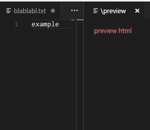

DEPRECATED - use https://github.com/Microsoft/vscode-extension-samples/tree/master/webview-sample instead

## vscode-extension-boilerplate 

*very* simple project you can use as a base to create an extension that opens a preview

Adapted from [AREPL-vscode](https://github.com/almenon/arepl-vscode), which was in turn adapted from [live-html-preview](https://github.com/HarshdeepGupta/live-html-preview)

Want more examples? see https://github.com/Microsoft/vscode-extension-samples

### Developer Setup:

1. Install VSCode (duh) and node, if not already installed
2. clone the repo
3. run npm install
4. Start it up!

### Unit tests:

You can get a free [travis](travis-ci.org) account to run unit tests

Once you do that update your badge in the readme to point to your travis page
